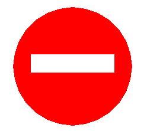

# 例题1-1：绘制“禁行”交通标志

### 题目描述

请利用 **Python 语言中 Turtle 模块** 的相关函数，在窗口中绘制如图所示“禁行”交通标志。
“禁行”交通标志由 1 个圆形和 1 个矩形构成，并且分别填充红色（`red`）和白色（`white`），线条颜色和填充颜色一致。

图形要求：整体位置合适、尺寸适中、图形类似、图形相对位置正确、效果清晰、完整。
（Turtle 模块的相关函数可以参考附件 1.doc）



## 输入样例
```
（无输入）
```

## 输出样例
```
（无输出）
```