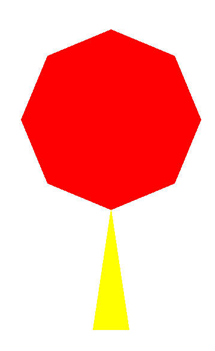

# 第一课：海龟作图题

## 例题1-1：绘制“禁行”交通标志

### 题目描述

请利用 **Python 语言中 Turtle 模块** 的相关函数，在窗口中绘制如图所示“禁行”交通标志。
“禁行”交通标志由 1 个圆形和 1 个矩形构成，并且分别填充红色（`red`）和白色（`white`），线条颜色和填充颜色一致。

图形要求：整体位置合适、尺寸适中、图形类似、图形相对位置正确、效果清晰、完整。
（Turtle 模块的相关函数可以参考附件 1.doc）


### 答案示例

```python
import turtle
# 圆形
turtle.color('red')
turtle.fillcolor('red')
turtle.begin_fill()
turtle.circle(100)
turtle.end_fill()

# 抬笔定位
turtle.penup()
turtle.goto(-70,120)
turtle.pendown()

# 矩形
turtle.color('white')
turtle.fillcolor('white')
turtle.begin_fill()
turtle.goto(70,120)
turtle.goto(70,150)
turtle.goto(-70,150)
turtle.goto(-70,120)
turtle.end_fill()
```


## 例题1-2：绘制组合图形

### 题目描述

不同的形状可以组合成各种丰富的图案，程序设计语言也可以绘制不同形状组合成的有趣图形。
请利用 **Python 语言中 Turtle 模块** 的相关函数，在窗口中绘制图形。

### 答案示例1

```python
import turtle as t

# 画长方形并填充
t.pencolor('blue')
t.fillcolor('blue')
t.begin_fill()
t.goto(240,0)
t.goto(240,40)
t.goto(0,40)
t.goto(0,0)
t.end_fill()

# 抬笔定位落笔
t.up()
t.goto(120,20)
t.down()

# 画多边形并填充
t.pencolor('green')
t.fillcolor('green')
t.begin_fill()
t.circle(100,360,6)
t.end_fill()
t.hideturtle()
```


### 答案示例2

```python
import turtle 

# 画八边形并填充
turtle.pencolor('red')
turtle.fillcolor('red')
turtle.begin_fill()
turtle.circle(150,360,8)
turtle.end_fill()

# 画三角形并填充
turtle.pencolor('yellow')
turtle.fillcolor('yellow')
turtle.begin_fill()
turtle.goto(-30,-200)
turtle.goto(30,-200)
turtle.goto(0,0)
turtle.end_fill()
turtle.hideturtle()
```




### 答案示例3

```python
import turtle as t

# 画圆并填充
t.pencolor('green')
t.fillcolor('green')
t.begin_fill()
t.circle(100)
t.end_fill()

# 抬笔定位落笔
t.up()
t.goto(-20,50)
t.down()

# 画三角形并填充
t.pencolor('black')
t.fillcolor('black')
t.right(30)
t.begin_fill()
t.circle(50,360,3)
t.end_fill()
```


# 第二课：顺序结构题

## 例题2-1：计算 BMI 指数

### 题目描述

BMI 指数（Body Mass Index，简称 BMI）是用体重（kg）除以身高（m）的平方得到的数字，是衡量人体胖瘦程度的常用标准。
请编写程序，根据用户输入的体重和身高，计算并输出 BMI 指数（保留 1 位小数）。
要求：提示用户输入体重和身高，输出BMI指数，保留一位小数

### 答案示例

```python
a = float(input("请输入体重（公斤）："))
b = float(input("请输入身高（米）："))
c = a / b**2
c = round(c, 1)
print("BMI指数是", c)
```

### 输入样例

```
请输入体重（公斤）：60.5
请输入身高（米）：1.7
```

### 输出样例

```
BMI指数是：20.9
```


## 例题2-2：计算布料能做多少套衣服

### 题目描述

服装厂做一套衣服用布 3 米，本月服装厂新进布料 a 米（零头不算）。
请编写程序计算并输出本月新进的布料最多能够做成多少套衣服（套）。
要求：屏幕提示用户输入新进布料的长度，输出能够做成多少套衣服（套）。

### 答案示例

```python
a = int(input("请输入新进布料的长度："))
b = a // 3
print("能够做成多少套衣服：", b)
```

### 输入样例

```
请输入新进布料的长度：35
```

### 输出样例

```
能够做成多少套衣服：11
```


## 例题2-3：计算火柴数量

### 题目描述

摆一个三角形需要 3 根火柴，摆 2 个三角形需要 6 根火柴。
请编写程序，输入摆放三角形个数，输出所需火柴数量。

### 答案示例

```python
a = int(input("请输入摆放三角形个数："))
b = a * 3
print("需要火柴：", b, "根")
```

### 输入样例

```
请输入摆放三角形个数：4
```

### 输出样例

```
需要火柴：12根
```


## 例题2-4：计算购书优惠金额

### 题目描述

为民书店促销：每消费满 100 元减 50 元。
如果顾客购买图书a元，请编写一个程序，根据用户输入的数值，计算并输出优惠的金额（元）。 
要求：屏幕提示用户输入顾客购买图书的总价格，输出优惠的金额（元）。

### 答案示例

```python
a = float(input("请输入图书总价格（元）："))
b = a // 100 * 50
print("优惠金额为", b)
```

### 输入样例

```
请输入图书总价格（元）：211.9
```

### 输出样例

```
优惠金额：100.0
```


## 例题2-5：计算阅读签到积分

### 题目描述

为提升学生阅读积极性，某网站推出一项活动：阅读签到获得积分，可以用积分换购。具体细则是：签到1次得1个积分，签到2次共得4个积分，签到3次共得7个积分，签到4次共得10个积分……。请编写一个程序，计算签到n次的积分。
要求：屏幕提示用户输入签到次数，输出得到的积分数。

### 答案示例

```python
a = int(input("请输入签到次数："))
jifen = 3 * a - 2
print("累计积分为：", jifen)
```

### 输入样例

```
请输入签到次数：7
```

### 输出样例

```
累计积分为：19
```

## 例题2-6：计算铁丝长度

### 题目描述

学习六角形，老师发给每人一根长a厘米的铁丝，要求用这根铁丝围成一个边长为整数的最大六角形，请编写一个程序，计算并输出围成一个最大六边形后还剩多长（厘米）。
要求：
屏幕提示用户输入铁丝的长度，输出围成一个最大六边形后还剩多长（厘米）。

### 答案示例

```python
a=int(input("请输入铁丝的长度："))
b=a%6
print("围成最大六边形后剩",b)
```

### 输入样例

```
50
```

### 输出样例

```
2
```

## 例题2-7：计算分书数量

### 题目描述

为了拓宽同学们的视野，学校图书馆购买了一批新书想平均分给18个班，请编写一个程序，计算并输出每个班能分到多少本书。
要求：
屏幕提示用户输入购买书的数量，输出每个班分到多少本书。

### 答案示例

```python
a=int(input("请输入书的数量："))
b=a//18
print("每个班能够分到的数量为",b)
```

### 输入样例

```
100
```

### 输出样例

```
5
```

## 例题2-8：计算球赛积分

### 题目描述

阳光四月校际足球联赛采用小组循环赛制，根据积分决定名次。计分规则为：赢一场得3分，平一场得1分，输一场不得分。
请编写一个程序，计算一支球队的联赛分。
要求：屏幕提示用户输入该球队的胜、平、负的场次，输出该球队的联赛积分。

### 答案示例

```python
a=int(input("请输入获胜场次："))
b=int(input("请输入打平场次："))
c=int(input("请输入打输场次："))
jifen=3*a+b
print("联赛积分为：",jifen)
```

### 输入样例

```
请输入获胜场次：4
请输入打平场次：2
请输入打输场次：2
```

### 输出样例

```
联赛积分为：14
```


# 第三课：循环与分支结构题

## 例题3-1：统计合格比例与最大值

### 题目描述

在技术与设计课程中，同学们要完成一个桥梁承重的项目活动。除了协作、桥梁美观等指标外，还有一个关键的指标，就是承重量。承重量大于250克，就算承重量指标合格。小明很想知道班里n个小组制作的桥梁，合格的百分比是多少，以及最大承重量。现在有n个小组的桥梁作品，请编程判断合格作品的比例，保留一位小数，并找出最大承重量（要求用循环结构解决问题）。
例如有3个桥梁作品，每个桥梁承重量分别为345，231，543，则合格作品的百分比为66.7%，最大承重量543。
输入的第一个整数为桥梁作品数n，接着的n个整数表示各个桥梁的承重量。

### 答案示例

```python
n = int(input("请输入桥梁的数量："))
t = 0
max_val = 0
for i in range(1, n+1):
    a = int(input("第" + str(i) + "个桥梁承重量："))
    if a >= 250:
        t += 1
    if a > max_val:
        max_val = a
b = round(t / n * 100, 1)
print("合格作品百分比：", b, "%")
print("最大承重量：", max_val)
```

### 输入样例

```
请输入桥梁的数量：4
第1个桥梁承重量：356
第2个桥梁承重量：253
第3个桥梁承重量：180
第4个桥梁承重量：395
```

### 输出样例

```
合格作品百分比：75.0%
最大承重量：395
```


## 例题3-2：打印机墨盒数量统计

### 题目描述

假设每个墨盒可打印 500 张纸，请设计一个程序，统计每天若干老师打印的数量，最后输出需要墨盒的数量。

### 答案示例

```python
s = 0
n = int(input("请输入教师的数量："))
for i in range(1, n+1):
    a = int(input("第" + str(i) + "位教师打印量："))
    s += a
if s % 500 == 0:
    m = s // 500
else:
    m = s // 500 + 1
print("共需要墨盒", m, "个")
```

### 输入样例

```
请输入教师的数量：4
第1位教师打印量：256
第2位教师打印量：153
第3位教师打印量：380
第4位教师打印量：395
```

### 输出样例

```
共需要墨盒  3  个
```


## 例题3-3：统计最少木棍使用量

### 题目描述

小明发起了一个建筑模型社团，组建了n个小组，这学期他们的活动重点是搭建轻型木桥。期末了，小明要统计每个小组的木棍使用量，并找出最少用量，以便大家总结经验教训。（要求用循环结构解决该问题）。
例如：输入4个小组木棍分别的使用量是390、435、410、475，共使用木棍1710，使用量最少的是390这个小组。
输入的第一个整数是小组的数目n，接着的n个整数表示每组使用的木棍数量。

### 答案示例

```python
n = int(input("小组数："))
min_val = 99999
s = 0
for i in range(1, n+1):
    a = int(input("第" + str(i) + "组木棍使用量："))
    s += a
    if a < min_val:
        min_val = a
print("共使用木棍：", s, "最少的组用量：", min_val)
```
### 输入样例

```
小组数：5
第1组木棍使用量：30
第2组木棍使用量：230
第3组木棍使用量：290
第4组木棍使用量：320
第5组木棍使用量：210
```

### 输出样例

```
共使用木棍：1080，最少的组用量：30
```


## 例题3-4：统计到校人数与所需教室

### 题目描述

欢迎小学生到中学进行入学准备参观，因每天接待多所学校，现在需要统计当天到校人数，并按照每40人安排几个教室作为休息室。请编写程序，输入来源学校是几所，并统计所有人数，再安排教室数量。（要求用循环结构解决问题）。

### 答案示例

```python
s = 0
n = int(input("今日到访学校："))
for i in range(1, n+1):
    a = int(input("第" + str(i) + "所学校来人："))
    s += a

if s % 40 == 0:
    b = s // 40
else:
    b = s // 40 + 1
print("今日共来人：", s)
print("今日需要安排教室：", b, "个")
```

### 输入样例

```
今日到访学校：3
第1所学校来人：175
第2所学校来人：231
第3所学校来人：120
```

### 输出样例

```
今日共来人：526
今日需要安排教室：14个
```


## 例题3-5：统计可保留文创产品

### 题目描述

学校的学生创业公司把今年文创比赛获奖的产品都生产出来进行销售，如果某种文创产品的销量比去年平均销售量（125件）高则可以继续保留生产。现创业公司要统计今年销量最大的文创产品的销售量以及可以保留生产的文创产品种类数。
请编写程序实现：输入今年文创产品的种类数量并依次输入每种文创产品的销售件数，输出今年销量最大的文创产品的销售量以及可以保留生产的文创产品种类数。

### 答案示例

```python
s = 0
m = 0
n = int(input("请输入今年销售的文创产品的种类数量："))
for i in range(1, n+1):
    a = int(input("第" + str(i) + "号产品的销售件数是："))
    if a > m:
        m = a
    if a > 125:
        s += 1
print("今年销量最大的文创产品销量是：", m, "件")
print("可以保留生产的文创产品种类有：", s, "种")
```

### 输入样例

```
请输入今年销售的文创产品的种类数量：5
1号产品的销售件数是：133
2号产品的销售件数是：77
3号产品的销售件数是：98
4号产品的销售件数是：210
5号产品的销售件数是：183
```

### 输出样例

```
今年销量最大的文创产品销量是： 210 件
可以保留生产的文创产品种类有： 3 种
``


## 例题3-6：计算支架数

### 题目描述

生物社团到植物园参加活动，帮忙给小树苗搭支架，为了方便管理，每棵苗都是按顺序编号的，现在需要每隔一棵苗（也就是给奇数编号的树苗），也就是给奇数编号的树苗安装一个支架，小明注意到，他负责的这排，编号是从a到b，请你帮小明编写一个程序，计算小明要装多少个支架？（要求用循环结构解决该问题）。

### 答案示例

```python
a=int(input("树苗开始编号是："))
b=int(input("树苗结束编号是："))
s=0
for i in range(a,b+1):
if i% 2==1:
   s=s+1
print("小明要安装的支架是：",s, "个")
```

### 输入样例

```
树苗开始编号是：11
树苗结束编号是：20
```

### 输出样例

```
小明要安装的支架是：5个
```


## 例题3-7：计算愿望数

### 题目描述

小明的妈妈让小明在学习之余去社区图书馆帮忙，为了鼓励他坚持这项活动，他每去一次妈妈都会根据他活动的时间和完成任务发放一定数量的愿望星，当攒够了一定的愿望星，妈妈就能满足他一个合理的愿望。请帮助小明写一个程序，通过他去年12个月每个月得到的愿望星数目，计算他去年一共获得多少颗愿望星，平均每月获得了多少？（要求用循环结构解决该问题，平均数结果保留一位小数）。

### 答案示例

```python
s=0
for i in range(1,13):
    a=int(input(str(i)+"月获得的愿望星个数是："))
    s=s+a
print("去年小明一共获得愿望星" , s,"颗")
print("平均每个月获得的愿望星是：" , round(s/12, 1) ,"颗")
```

### 输入样例

```
1月获得的愿望星个数是：7
2月获得的愿望星个数是：5
3月获得的愿望星个数是：11
4月获得的愿望星个数是：3
5月获得的愿望星个数是：6
6月获得的愿望星个数是：4
7月获得的愿望星个数是：9
8月获得的愿望星个数是：6
9月获得的愿望星个数是：10
10月获得的愿望星个数是：8
11月获得的愿望星个数是：12
12月获得的愿望星个数是：9
```

### 输出样例

```
去年小明一共获得愿望星 90 颗
平均每个月获得的愿望星是： 7.5 颗
```


## 例题3-8：计算正确率

### 题目描述

2020年因为疫情师生们开始了停课不停学的网上学习。这不，老师在网上公布了一道单项选择题，同学们纷纷通过网络输入了自己的选择，用1,2,3,4分别代表自己的选项。这道题的答案选项应该是3，请你帮老师编写一个程序统计班里同学们的正确率。（要求用循环结构解决问题，结果保留一位小数）。

### 答案示例

```python
n = int(input("提交答案的同学一共有（名）："))
s = 0
for i in range(1,n+1):
    a = int(input("第"+str(i)+"位同学提交的答案是："))    
    if a == 3:
        s = s + 1
s=round(s/n*100,1)
print("同学们的正确率是：",s,"%")
```

### 输入样例

```
提交答案的同学一共有（名）：10
第1位同学提交的答案是：3
第2位同学提交的答案是：3
第3位同学提交的答案是：4
第4位同学提交的答案是：3
第5位同学提交的答案是：1
第6位同学提交的答案是：3
第7位同学提交的答案是：3
第8位同学提交的答案是：2
第9位同学提交的答案是：3
第10位同学提交的答案是：3
```

### 输出样例

```
同学们的正确率是： 70.0 %
```


## 例题3-9：猴子定律

### 题目描述

国外的管理学专家曾经提出一个猴子定律:如果让一只猴子在键盘上跳舞，如果时间足够长，也可以敲出一部名著。小明想通过计算机模拟这个原理，当然不能随机敲出一部小说。他想这样模拟：闭眼在小键盘的数字区随意输入，每次输入包括一个随意的数字和一次回车键，统计多少次输入可以得到9。假设总的输入次数不超过1000次。（要求用循环结构解决该问题）
例如小明分别在键盘上按下7、5、8、4、3、9，则他输入了6次得到了9。
输入若干行，每行一个字符，分别是小明在键盘上按下的数字键。

### 答案示例

```python
for循环：
for i in range(1,1001):
    n = input("小明在键盘上按下的键是：")
    if n == '9': 
        break
print("小明按了",i,"次按到了9")


【while循环】
t=0
while 1:
    a=int(input("小明在键盘上按下的键是："))
t=t+1
if a==9:
break
print("小明按了",t,"次按到了9")
```

### 输入样例

```
小明在键盘上按下的键是：7
小明在键盘上按下的键是：5
小明在键盘上按下的键是：8
小明在键盘上按下的键是：4
小明在键盘上按下的键是：3
小明在键盘上按下的键是：9
```

### 输出样例

```
小明按了：6次按到了9
```

# 第四课：选择结构题

## 例题4-1：计算心脏回复率

### 题目描述

运动后心脏恢复率是一个有效的健康标准，某心率监测设备通过记录使用者运动刚结束后 1分钟内的心率数a，和停止运动1分钟后的心率数b，计算出心脏恢复率r= (a- b)/10 。如果r大于3 （含），则表示心脏恢复率良好，否则表示心脏恢复率不佳。请编写一个程序，输入某人运动后的心跳数 a和b （均为正整数），输出心脏恢复率和心脏恢复状况。（用选择结构解决该问题）

### 答案示例

```python
a=int(input("请输入心跳数 a"))
b=int(input("请输入心跳数 b"))
r =(a-b)/10
if r>=3:
print("心脏恢复率为",r,"良好")
else:
print("心脏恢复率为",r,"不佳")
```

### 输入样例

```
请输入心跳数 a 161
请输入心跳数 b 113
```
```
请输入心跳数 a 170
请输入心跳数 b 145
```

### 输出样例

```
平均值为： 4.8 良好
```
```
平均值为： 2.5 不佳
```


## 例题4-2：计算占用字节数

### 题目描述

计算机中存储一个“0”或“1”占用一个二进制位。8个二进制位称为一个字节。请编写一个程序，输入二进制位的个数（正整数），输出占用的字节数。 （用 选择 结构解决该问题）


### 答案示例

```python
a=int(input("请输入二进制位的个
数："))
If a%8==0:
   b=a//8
else:
   b=a//8+1
print("占用字节数",byte)

```

### 输入样例

```
4
请输入二进制位的个数：3
```
```
4
请输入二进制位的个数：9
```

### 输出样例

```
占用字节数 1
```
```
占用字节数 2
```

## 例题4-3：计算快递费

### 题目描述

某快递公司规定，寄往某地的包裹首重（1千克内，含1千克）价格为15元，续重（每1千克）价格为10元，不足1千克，按1千克计。但是总价如果超过了100元（含），快递费用可打9折， 请编写一个程序，输入包裹重量（正整数，单位千克），输出需要支付的快递费。（用 选择结构解决该问题）

### 答案示例

```python
x=int(input("请输入包裹重量（正整数，
千克）："))
y=15+(x-1)*10
if y<=100:
s=y
else:
s=y*0.9
print("需要支付的快递费为：",s,"元")
```

### 输入样例

```
请输入包裹重量（正整数，千克）：4
```
```
请输入包裹重量（正整数，千克）：11
```

### 输出样例

```需要支付的快递费为： 45 元
```

```
需要支付的快递费为： 103.5 元
```

## 例题4-4：购书问题

### 题目描述

某图书商店规定，购买100本以下的同本书不打折；如果客户一次性购买100  本（含）以上的同本书，则每本书的价格打 9折；如果一次性购买500本（含）以上的同本书，则每本书的价格打8折。 请编写一个程序，输入某 本书的单价（浮点数）和购买数量（正整数），输出 总价。（用选择 结构解决该问题）
### 答案示例

```python
m=float(input("请输入单价（元）:"))
n=int(input("请输入数量（本）:"))
if n<100:
f=m*n
elif n<500:
f=m*0.9*n
else:
f=m*0.8*n
print("总价为：",f,"元")
```

### 输入样例

```
请输入单价（元）:26.0
请输入数量（本）:500
```

### 输出样例

```
总价为： 10400.0 元
```


# 第五课：简答题

## 题目：信息系统与社会

### 题目描述

信息系统的普及应用使我们享受科技成果的同时，也带来一系列安全问题，例如：

* 点击邮件中的不明链接导致电脑中病毒；
* 登录系统时提示用户名或密码错误；
* 在活动中登记信息后被推销电话骚扰；
* 扫描广告二维码后资金被盗。

请结合生活实际，说明如何防范这些信息安全风险。

### 答题要点

* 遇到可疑链接或附件时不要随意点击。
* 设置复杂密码并妥善保管账号信息。
* 谨慎填写个人资料，不在不安全网站留信息。
* 使用双重验证和防病毒软件确保安全。
